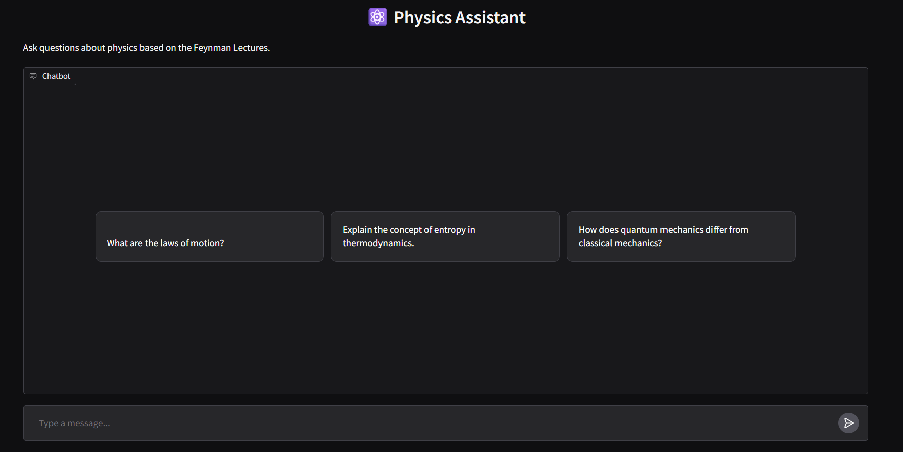
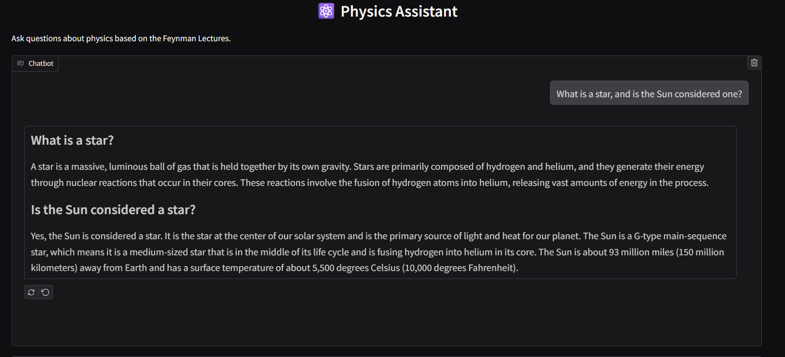
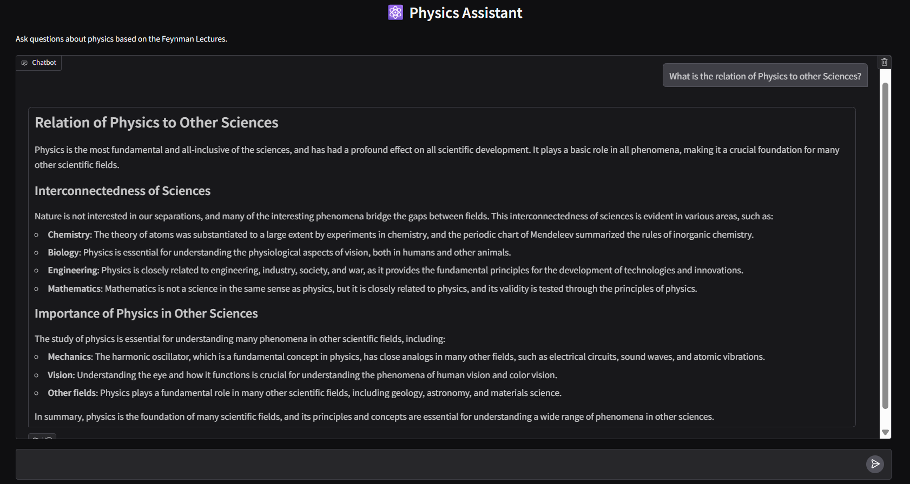
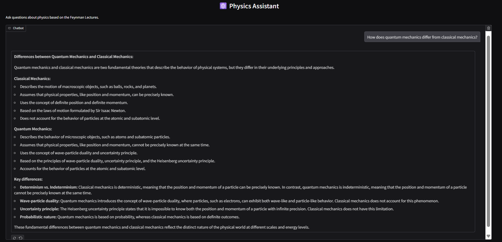
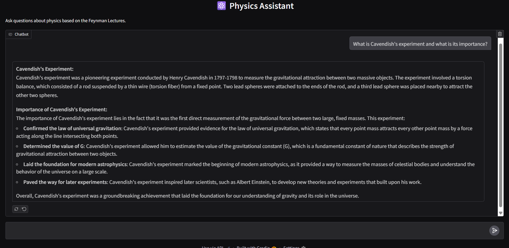
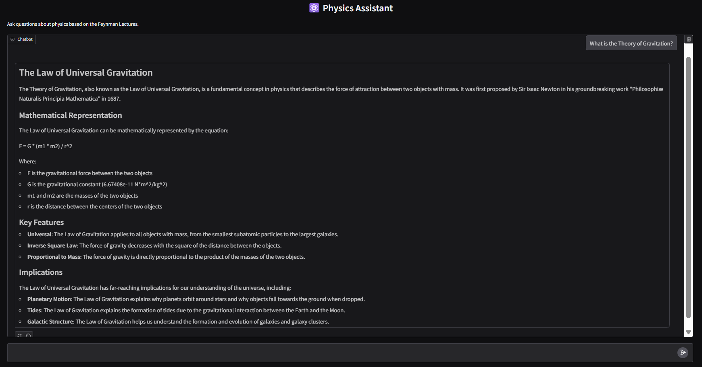

# ⚛️ Physics Assistant: Feynman Lectures Chatbot

A **Retrieval-Augmented Generation (RAG)**-based chatbot designed to answer physics questions using content from the legendary **Feynman Lectures on Physics**. This assistant combines powerful document retrieval with large language models (LLMs) to provide detailed, context-aware responses.

Built using **LangChain**, **Gradio**, and **ChromaDB**.

---

## 🧠 Project Overview

The Physics Assistant follows a **RAG pipeline** that retrieves relevant sections from the *Feynman Lectures* and feeds them into an LLM to generate accurate and insightful answers.

### ✨ Key Features

- 🔍 **Accurate Retrieval**: Uses vector search to find the most relevant content from the Feynman Lectures.
- 🤖 **Context-Aware Responses**: Leverages LLMs (e.g., LLaMA) for generating coherent answers grounded in retrieved content.
- 💬 **User-Friendly Interface**: Powered by Gradio for seamless interaction.
- ⚡ **Fast Local Inference**: Utilizes ChromaDB for efficient local vector search and storage.

---

## 🖥️ Interface Preview

---

## 📌 Sample Use Cases

Here are some example interactions with the assistant:

### ☀️ Question on Stars

---

### ⚖️ Physics vs Other Sciences

---

### 🧿 Quantum Mechanics

---

### 🧪 Cavendish's Experiment

---

### 🌌 Theory of Gravitation

---

## 🚀 Get Started

Instructions on setup, dependencies, and running the assistant locally will be added soon.

---

## 📚 Source

All content is based on The Feynman Lectures on Physics

---
